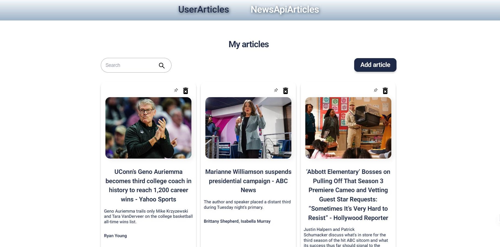

# NewsAPI Articles

An application designed for article search, adding personal articles, and
fetching news articles.

## Features

- Fetching articles from NewsAPI
- Search by title and description
- Pinning articles
- Pagination with 'Load more' button

## Technologies used:

- React.js
- Redux Toolkit
- Styled Components
- NewsAPI

## Test Task

Create a webpage that shows lists of articles. Users can add or remove article
(only created by user). Also users should be able to pin item, it means the item
has to be the first in the list. Only one pinned item allowed. Items can be
searched by the name or description. Also implement a page where 10 articles are
displayed from https://newsapi.org/ , and add a button that will allow the user
to get additional 10 articles, the articles should not be repeated if the user
clicks the button several times.
